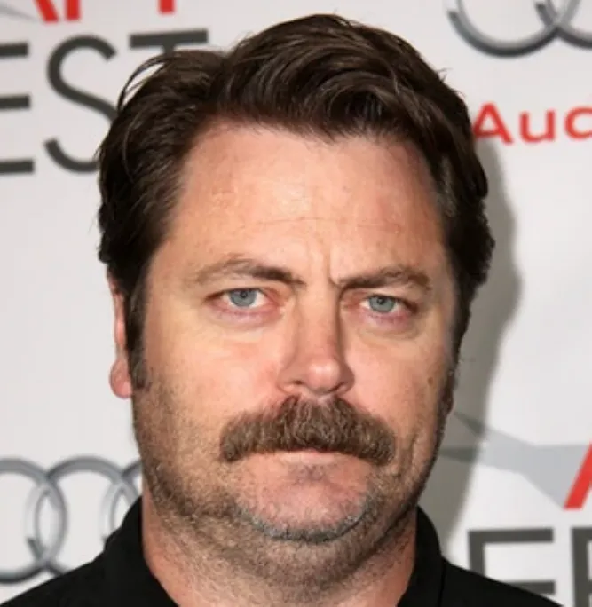

# Storyboard

A CLI tool for generating storyboards. Define characters, create reusable templates, and build interactive scenes through YAML configuration.

See an example: [storyboard.kierangill.xyz](https://storyboard.kierangill.xyz/). Deployed using `storyboard serve`.

## Quickstart

Install `storyboard` with `pip` or `uv`:

```
pip install storyboard-cli
```

Or with `uv`:

```
uv tool install storyboard-cli
```

Create a project:

```
storyboard init
```

You'll be asked to provide a project name and a Gemini API key, which you can get [here](https://aistudio.google.com/app/apikey).

Generate images and audio from the template:

```
storyboard generate
```

The output will be in `output/`. You can also view in a browser using the `serve` command:

```
storyboard serve
```

## Example

```yaml
# Character with voice and appearance
_nick:
  name: Nick
  reference_photo: ./assets/nick.webp
  tts:
    style: Narrate in a frantic tone
    voice: Fenrir

# Reusable image template with variables
_oblivion_inventory:
  instructions: |
    Turn the person in this photo {image $character_reference} into the style of an Oblivion character and create an inventory screen like in this picture: {image ./assets/oblivion_inventory.webp}
    The character should be equipped with the following items: {$inventory_items}. 
    The background setting should be: {$background}. 
    In the inventory section on the left side of the screen, display this list of items: {$inventory_items}.{$extra_instructions}

# Scene with frame that uses the template
_inn:
  name: The Aftermath
  frames:
    _inventory:
      image:
        template: _oblivion_inventory
        $character_reference: "@characters._nick.reference_photo"
        $inventory_items: empty skooma bottle
        $background: Inside a medieval tavern
        $extra_instructions: The character is in a bed, with Skooma bottles on his bedside table.
```

| Input: Reference photo | Input: Inventory screen | Output |
|------------------|------------------------|--------|
|  |  |  |


## How It Works

1. **Define characters** with voice attributes and reference photos for consistent appearance.
2. **Create templates** for images and dialogue.
3. **Build scenes** containing frames that render templates with specific values.
4. **Generate storyboard assets** using Gemini models.
5. **Reference data** across the configuration using cross-references (`@`).

## Syntax

See [docs/SYNTAX.md](docs/SYNTAX.md).

## Usage

### `storyboard init`

Initialize a new storyboard project with example files and configuration.

```bash
storyboard init [--name PROJECT_NAME]
```

**Options:**
- `--name`: Project name (prompts interactively if not provided)

Creates a new project directory with:
- `content/main.yaml` - Main configuration file
- `content/characters.yaml` - Character definitions
- `content/scenes.yaml` - Scene descriptions
- `content/image_templates.yaml` - Reusable image templates
- `content/tts_templates.yaml` - Reusable TTS templates

---

### `storyboard generate`

Generate all images and audio from your storyboard YAML files.

```bash
storyboard generate [--input PATH] [--output DIR] [--root-dir DIR]
```

**Options:**
- `--input`: Path to main.yaml file (default: `content/main.yaml`)
- `--output`: Output directory for generated scenes (default: `./output`)
- `--root-dir`: Root directory for resolving relative paths in SDL (default: parent directory of input file)

Uses caching to avoid regenerating assets. If the prompt and model match an existing cache entry, the cached version is used.


### `storyboard serve`

Start a local web server to view generated scenes in your browser.

```bash
storyboard serve --scene-folder DIR [--port PORT]
```

**Options:**
- `--scene-folder`: Path to output directory containing `metadata.json` (required)
- `--port`: Server port (default: 6767)

Opens an interactive viewer to navigate through scenes and frames.


### `storyboard update`

Regenerate specific assets, bypassing the cache.

Interactively select a scene and frame:

```bash
storyboard update
```

Update a specific scene + frame + asset type:

```bash
storyboard update <target>
# Example: 
#   storyboard update my_scene.bedroom
#   storyboard update my_scene.bedroom.tts
#   storyboard update my_scene.bedroom.image
```

Forces regeneration even if a cached version exists.

### `storyboard composite movie`

Composite all scenes and frames into a single movie file.

```bash
storyboard composite movie [--input PATH] [--output FILE]
```

**Options:**
- `--input`: Path to main.yaml file (default: `content/main.yaml`)
- `--output`: Output movie file path (default: `./output/movie.mp4`)

**Frame duration:**
- If audio exists: frame plays for the duration of the audio
- If no audio: uses `config.composite.movie.no_audio_length` (default: 5 seconds)

**Configuration example:**
```yaml
config:
  composite:
    movie:
      no_audio_length: 5  # seconds
```

### `storyboard image`

Generate a single image using Gemini's image generation models.

```bash
storyboard image --prompt "PROMPT" [OPTIONS]
```

**Options:**
- `--prompt`: Text prompt for image generation (required)
- `--reference-photos`: Paths to reference images (optional, space-separated)
- `--model`: Model selection: `pro` or `flash` (default: `pro`)
- `--output`: Output path to copy the generated image
- `--webp`: Convert output to WebP format
- `--no-cache`: Disable cache and always generate new image
- `--cache-directory`: Cache directory (default: `.storyboard/generated/images`)

**Example:**
```bash
storyboard image --prompt "A medieval knight" --reference-photos photo.jpg --webp --output knight.webp
```

### `storyboard tts`

Generate TTS audio using Gemini's text-to-speech models.

```bash
storyboard tts --voice-id VOICE --style-instructions "STYLE" --content "TEXT" --output-path DIR --output-name NAME [OPTIONS]
```

**Options:**
- `--voice-id`: Gemini voice name (e.g., `Aoede`, `Charon`, `Fenrir`) (required)
- `--style-instructions`: Voice style prompt (e.g., "Gruff and handsome man") (required)
- `--content`: Text to synthesize (required)
- `--output-path`: Output directory path (required)
- `--output-name`: Base filename without extension (required)
- `--cache-directory`: Cache directory (default: `.storyboard/generated/audio`)

**Example:**
```bash
storyboard tts --voice-id Fenrir --style-instructions "Narrate in a frantic tone" --content "Hello world" --output-path ./output --output-name greeting
```


## Configuration

Configuration settings:

```yaml
config:
  output:
    # Directory where final rendered output will be saved
    directory: ./output
    # Directories for caching generated images/audio
    # If there is a SHA match on a prompt+model, we will pull from the cache instead of regenerating.
    cache:
      images: .storyboard/generated/images
      audio: .storyboard/generated/audio

  image:
    default_model:
      # Default image generation vendor
      vendor: gemini
      # Default image generation model
      model: gemini-3-pro-image-preview
    optimize:
      # Enable image optimization to reduce file size
      enabled: true
      # Image quality level (0-100, higher is better quality)
      quality: 80

  tts:
    default_model:
      # Default text-to-speech vendor
      vendor: gemini
      # Default text-to-speech model
      model: gemini-2.5-flash-preview-tts
    optimize:
      # Enable audio optimization to reduce file size
      enabled: true
      # Audio quality level (1-10, higher is better quality; uses Opus)
      quality: 8

  generation:
    # Maximum number of concurrent generation requests
    max_concurrent: 10
    # Timeout in seconds for each generation request
    timeout_seconds: 120
    retry:
      # Enable automatic retry on generation failures
      enabled: true
      # Maximum number of retry attempts
      max_attempts: 3
      # Delay in seconds between retry attempts
      delay_seconds: 2
```
